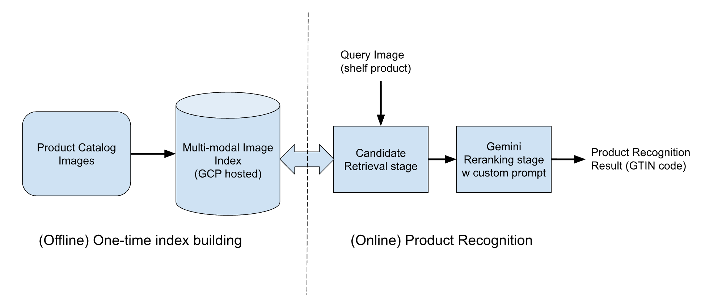

# Product Recognizer GTIN using Gemini

**[한국어 버전 (Korean)](README_ko.md)**

A GTIN (Global Trade Item Number)-based product recognition system that identifies products from store shelf images and matches them to the exact product in a catalog.

Since [Vision AI Product Recognizer](https://docs.cloud.google.com/vision-ai/docs/product-recognizer) is being deprecated, this project uses [Multi-Modal Embedding](https://docs.cloud.google.com/vertex-ai/generative-ai/docs/model-reference/multimodal-embeddings-api) and VectorDB to perform product image search, and uses Gemini for picking the right candidate after search. The overall diagram is shown in the architecture below.

## Architecture



```
 ========================= DATA PREPARATION (offline, one-time) ==========================

  +------------+     +---------------------+     +-------------------------+
  | Product    |     | Multimodal          |     | Vertex AI               |
  | Catalog    |---->| Embedding Model     |---->| Matching Engine         |
  | (CSV)      |     | (Image -> 128D vec) |     | (Vector Index)          |
  +------------+     +---------------------+     +-------------------------+
       |                                                  |
       |         +--------------+                         |
       +-------->| GCS Bucket   |<------------------------+
                 | (image &     |   embedding cache
                 |  embed cache)|
                 +--------------+

 ============================ INFERENCE (online, per query) ===============================

  +------------------+
  | Store Shelf      |
  | Photo            |
  +--------+---------+
           |
           v
  +----------------------------------+
  | Step 1. Image Preprocessing      |
  |                                  |
  |  +--------------+ +------------+ |
  |  | Square       | | Margin     | |
  |  | Padding      | | Crop       | |
  |  | (white bg)   | | (context)  | |
  |  +------+-------+ +-----+------+ |
  +---------|------------|---+--------+
            |            |
            v            |
  +-----------------------|----------+
  | Step 2. Vector Search |          |
  |                       |          |
  |  Padded Image         |          |
  |       |               |          |
  |       v               |          |
  |  Embedding Model      |          |
  |       |               |          |
  |       v               |          |
  |  Matching Engine      |          |
  |  (ANN Search)         |          |
  |       |               |          |
  |       v               |          |
  |  Top-K Candidates     |          |
  |  (20 products)        |          |
  +---------+-------------|----------+
            |             |
            v             v
  +--------------------------------------+
  | Step 3. Gemini Reranking (LLM)       |
  |                                      |
  |  Input:                              |
  |   - Query image (padded)             |
  |   - Zoomed-out image (segment)       |
  |   - Candidate images + titles        |
  |                                      |
  |  Gemini 2.0 Flash                    |
  |  (brand/variant/weight/package       |
  |   visual comparison)                 |
  |                                      |
  |  Output:                             |
  |   { color, title, candidate }        |
  +------------------+-------------------+
                     |
                     v
          +---------------------+
          | Matched Product     |
          | (GTIN identified)   |
          +---------------------+
```

### Key Design Decisions

- **2-Stage Retrieve & Rerank**: Vector search narrows candidates fast (Step 2), then Gemini LLM performs detailed visual comparison to select the final product (Step 3).
- **Dual Query Images**: Both padded (square, white background) and margin-cropped (with shelf context) images are used together to improve recognition accuracy.
- **Punting**: Returns `candidate = -1` when the shelf is empty, a price tag is misdetected, or no match is found, avoiding false positives.
- **GCS Caching**: Images and embeddings are cached in GCS to avoid redundant computation.
- **GTIN Deduplication**: Multiple dedup strategies prevent the same product from appearing multiple times in candidates.

## Notebook Cell Overview

| Cell | Title | Description |
|------|-------|-------------|
| 0 | Imports | Install and import libraries (Google Cloud, Vertex AI, Gemini, PIL, etc.) |
| 1 | Global Parameters & Initialization | Configure project ID, GCS bucket, embedding dimension (128), model versions, retry strategy |
| 2 | [Library] Vertex Matching Engine | Core classes: `GcsUri` (GCS image management, embedding, neighbor search), `Product` (metadata), `Match` (search result). Dataset loading, index upsert, visualization functions |
| 3 | [Library] Gemini Reranking | 6 Gemini prompt configurations (basic, punting, letter, CoT variants). Prompt builders for single/margin/letter/reverse formats. Response parsing |
| 4 | Read Catalog | Load product catalog CSV and build GTIN-to-image/title lookup dictionaries |
| 5 | Prepare Vertex Matching Engine | Create or reuse Vector Index and IndexEndpoint |
| 6 | [RunOnce] Load data and build index | Load product dataset, generate embeddings, upsert to Vector Index |
| 7 | [Optional][RunOnce] Pad product image | Pad product images to square with white background for query preprocessing |
| 8 | [Optional][RunOnce] Segment product | Crop product regions from store frames with margin for query preprocessing |
| 9 | [Demo] End2End flow | Full pipeline demo for a single product recognition query |

## Prerequisites

### 1. Google Cloud Project

| Item | Description | Notebook Parameter |
|------|-------------|--------------------|
| GCP Project | A project with Vertex AI enabled | `PROJECT_ID` |
| Region | Default: `us-central1` | `LOCATION` |
| GCS Bucket | For image/embedding cache and dataset storage | `BUCKET` |
| Authentication | `gcloud auth login` or service account configured | - |

### 2. GCP APIs to Enable

- **Vertex AI API** - Matching Engine, embedding model, Gemini
- **Cloud Storage API** - GCS bucket access
- **Generative AI API** - Gemini model calls

### 3. IAM Permissions

The executing account needs:

- **Vertex AI User** (`roles/aiplatform.user`) - Matching Engine, embedding model, Gemini calls
- **Storage Object Admin** (`roles/storage.objectAdmin`) - GCS read/write for image caching

### 4. Data Preparation

#### Product Catalog CSV (`DATASET`)

Must reside inside the GCS bucket. Required columns:

```csv
entity_uuid,product_title,brand_name,gtins,images
abc-123,"Product Name","Brand",1234567890|9876543210,https://img1.jpg||https://img2.jpg
```

- `gtins`: pipe-delimited (`|`) product barcodes
- `images`: double-pipe-delimited (`||`) image URLs

#### Query Set JSONL (`QUERYSET`, for evaluation)

Each line contains a JSON object with an `imageUri` field:

```json
{"imageUri": "https://example.com/shelf-photo.jpg"}
```

#### Detection Result CSV (optional, for image preprocessing)

Required columns: `imageUri`, `frameUrl`, `x`, `y`, `w`, `h` (bounding box of detected products on shelf frames)

### 5. Model Selection

| Model | Parameter | Purpose |
|-------|-----------|---------|
| Multimodal Embedding | `EMBEDDING_MODEL_NAME` | Image to 128-dimensional vector |
| Gemini | `GEMINI_MODEL_VERSION` | LLM reranking (default: `gemini-2.0-flash-001`) |

### 6. Vertex AI Matching Engine Resources

Auto-created on first run, or reuse existing:

| Resource | Parameter | Note |
|----------|-----------|------|
| Vector Index | `INDEX_NAME` | Tree-AH, cosine distance, stream update |
| Index Endpoint | `INDEX_ENDPOINT_NAME` | **~20 min for initial deployment** |
| Deployed Index ID | `DEPLOYED_INDEX_ID` | ID for the deployed index |

## Execution Order

```
1. Set parameters                (Cell 0-1)
2. Initialize libraries          (Cell 2-3)
3. Load catalog                  (Cell 4)     <- requires product CSV
4. Prepare Matching Engine       (Cell 5)     <- ~20 min on first run
5. Build index                   (Cell 6)     <- one-time, generates embeddings + upsert
6. Preprocess images             (Cell 7-8)   <- optional, one-time
7. Run inference                 (Cell 9)     <- repeatable
```

## Cost Considerations

| Resource | Billing |
|----------|---------|
| Matching Engine Index Endpoint | Hourly charge while deployed |
| Gemini API calls | Per-token billing (multiple images per query) |
| Embedding model calls | Per-call billing (products x images) |
| GCS storage & egress | Based on cached image/embedding volume |

## Python Dependencies

```
retrying
pandarallel
Pillow
ipywidgets
requests
rich
tqdm
google-cloud-aiplatform
google-cloud-storage
google-genai
```
